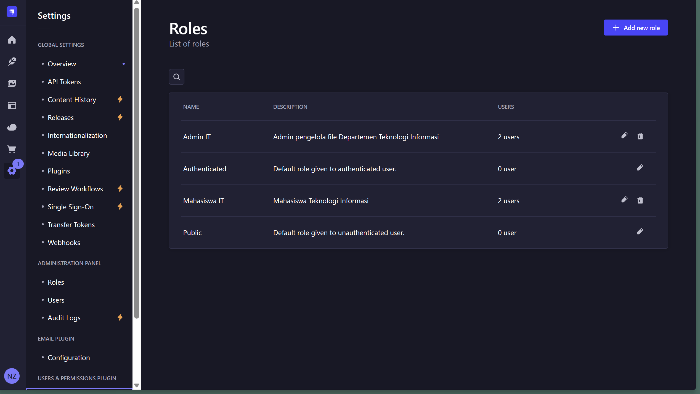
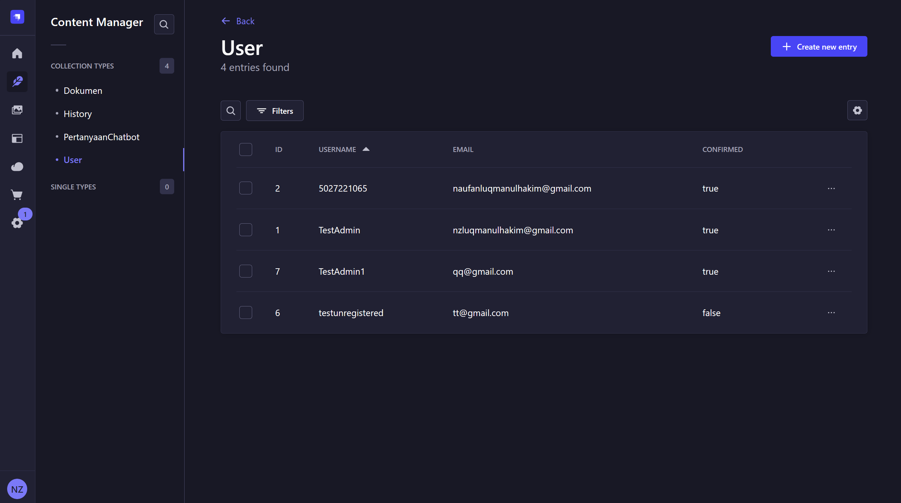

# Panduan Instalasi dan Penggunaan Knowledge Management System Departemen Teknologi Informasi (CATTY)

## Pendahuluan
Sistem Knowledge Management ini terdiri dari dua bagian utama:
- **Frontend**: Aplikasi web yang dibangun dengan React (dalam folder 'FECapstone')
- **Backend**: Server API yang dibangun dengan Strapi CMS (dalam folder 'BE-strapi')
- **Chatbot**: Server Chatbot dengan model Qwen (dalam folder 'BE-flask')

## Keperluan
- **docker**: untuk menjalankan seluruh instance

## Cara Menjalankan
### 1. Clone Repository ini
### 2. Setup Strapi
#### a. Membuat file `.env` pada directory `/capstone-knowledge-management-system/BE-strapi`
akses link berikut untuk mendapatkan isi file env
https://drive.google.com/drive/folders/1B9l45pT5-rzTfgudytjHPOS3ml4Pg4sJ?usp=sharing

### 3. Pastikan docker berjalan
#### a. Check status Docker 
```
sudo systemctl status docker
```
#### b. Start Docker
```
sudo systemctl start docker
```
#### c. Verifikasi berjalannya Docker
```
sudo docker run hello-world
```
### 4. Build image project
```
docker compose build --no-cache
```
### 5. Start container project
#### Start tanpa melihat log
```
docker compose up -d
```
#### Start dengan log
```
docker compose up
```
### 6. Akses Strapi UI pada browser dengan URL `http://localhost:1337/admin`

### 7. Setup Role
#### a. Menambahkan Role
- Pada tab `Settings` -> `Users & Permissions Plugin` -> `Add new Role`

- Tambahkan Role `Admin IT` dan `Mahasiswa IT`
- Berikan Permission
    - Admin IT: 
        - Dokumen (Semua)
        - History (Semua)
        - Pertanyaan Chatbot (Semua)
        - Upload (Semua)
        - Users Pemissions (Semua)
    <br>***Press `SAVE` ketika sudah selesai memberikan Permissions***
    - Mahasiswa IT:
        - Dokumen (create, find, findOne)
        - History (create)
        - Pertanyaan Chatbot (find, findOne)
        - Upload (find, findOne)
        - Users Permissions
            - Auth: kecuali resetPassword, changePassword
            - Permissions: getPermissions 
            - Role: find, findOne
            - User: findOne, find, me
            <br>***Press `SAVE` ketika sudah selesai memberikan Permissions***
- Membuat Role Admin Pertama
    - Akses Tab `Content Manager` -> `User`
    
    - Create new entry lalu isi konten: 
        - username
        - email
        - password
        - confirmed: TRUE
        - role: Admin IT
        - history: hiraukan
    - `Save`
### 8. Website sudah bisa diakses pada `http://localhost:3000/`
