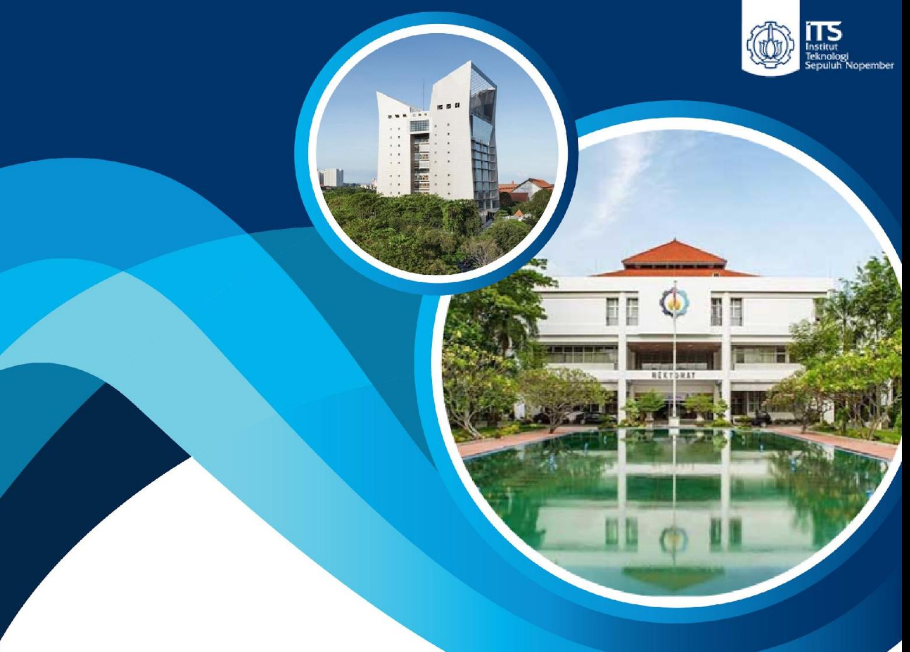

## DOKUMEN KURIKULUM 2023-2028 PRODI : S1 TEKNOLOGI INFORMASI DEPARTEMEN : TEKNOLOGI INFORMASI

FAKULTAS TEKNIK ELEKTRO DAN INFORMATIKA CERDAS INSTITUT TEKNOLOGI SEPULUH NOPEMBER 2022

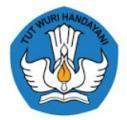

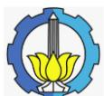

## DOKUMEN

## Penyusunan Kurikulum Pendidikan Tinggi

### Program Studi S1 Teknologi Informasi

**Surabaya, Januari 2023**

| Nama Ketua Tim | : Dr. Ir. Raden Venantius Hari Ginardi, MSc               |
|----------------|--------------------------------------------------------------|
| NIP/NIDN       | : 196505181992031003/ 0018056508                       |
| Program Studi  | : Teknologi Informasi                                     |
| Fakultas       | : Fakultas Teknologi Elektro dan Informatika Cerdas |

### INSTITUT TEKNOLOGI SEPULUH NOPEMBER, Tahun 2023

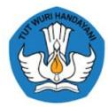

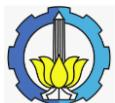

|  | INSTITUT TEKNOLOGI SEPULUH NOPEMBER Kampus ITS, Jl. Raya ITS, Keputih Sikolilo, Surabaya, 60111 Telpon (031) 5994251 URL www.its.ac.id | Nomor: 2.3.2.3.5.6.1  |
|--|----------------------------------------------------------------------------------------------------------------------------------------------------|--------------------------|
|  | DOKUMEN KURIKULUM                                                                                                                                  | Revisi: 1 Halaman : 2 |

|              | Penanggung Jawab                                |                                                                  |              |                 |
|--------------|-------------------------------------------------|------------------------------------------------------------------|--------------|-----------------|
| Proses       | Nama                                            | Jabatan                                                          | Tanda tangan | Tanggal         |
| Perumus      | Dr. Ir. Raden Venantius Hari                 | Ketua Tim Perumus Kurikulum                                   |              | 14 Juni 2023 |
|              | Ginardi, MSc                                    |                                                                  |              |                 |
| Pemeriksa    | Ir. Muchammad Husni, M.Kom                   | Tim SAR Lab KCKS Departemen Teknologi Informasi            |              | 14 Juni 2023 |
| Persetujuan  | Dr. Ir. Raden Venantius Hari Ginardi, MSc | Kepala Departemen Teknologi Informasi                         |              | 14 Juni 2023 |
| Penetapan    | Dr. I Ketut Eddy Purnama, S.T., M.T.         | Dekan Fakultas Teknologi Elektro dan Informatika Cerdas |              | 14 Juni 2023 |
| Pengendalian | Ir. Muchammad Husni, M.Kom                   | Tim SAR Departemen Teknologi Informasi                     |              | 14 Juni 2023 |

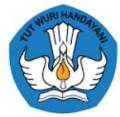

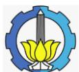

| 1. | DAFTAR ISI  3                                                                                |  |
|----|----------------------------------------------------------------------------------------------|--|
| 2. | KATA PENGANTAR  4                                                                            |  |
| 2  | VISI, MISI, DAN TUJUAN PENDIDIKAN  6                                                         |  |
| 4  | PROFIL LULUSAN, TUJUAN PENDIDIKAN PRODI DAN RUMUSAN CAPAIAN PEMBELAJARAN LULUSAN (CPL) 12 |  |
| 5  | PENENTUAN BAHAN KAJIAN  26                                                                   |  |
| 6  | PEMBENTUKAN MATA KULIAH DAN PENENTUAN BOBOT SKS  32                                          |  |
| 7  | ORGANISASI MATA KULIAH PROGRAM STUD  68                                                      |  |
| 8  | SEBARAN MATA KULIAH TIAP SEMESTER DAN PENJADWALAN PENGUKURAN CPL - KHUSUS BAGI               |  |
|    | PRODI YANG BERORIENTASI PADA AKREDITASI IABEE  82                                            |  |
| 9  | PEMBELAJARAN MELALUI MB - KM 92                                                              |  |
| 10 | RENCANA PEMBELAJARAN SEMESTER (RPS)  99                                                      |  |
| 11 | PENGELOLAAN PEMBELAJARAN  297                                                                |  |

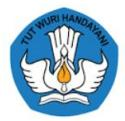

### **2. KATA PENGANTAR**

Kurikulum 2018 yang digunakan Departemen Teknologi Informasi pada program studi Sarjana Teknologi Informasi telah dilaksanakan dan telah menghasilkan lulusan-lulusan yang sesuai dengan target CPL maupun profil yang dibidik saat itu. Selama proses pembelajaran di tahun ajaran 2018/2019 hingga 2022/2023, telah dilakukan beberapa penyesuaian-penyesuaian pada pelaksanaan Kurikulum 2018, mengikuti perkembangan kebutuhan di bidang keilmuan teknologi informasi serta kebutuhan stakeholder seperti program Merdeka Belajar Kampus Merdeka.

Perkembangan kebutuhan di bidang keilmuan computing, khususnya pada bidang Teknologi Informasi telah dirumuskan dalam ACM Computing Curricula 2020 (CC2020) yang menjadi rujukan penyusunan Kurikulum Program Studi Sarjana Teknologi Informatika 2023 (Kurikulum S1 TI 2023) ini. Mengikuti kebutuhan stakeholder, Kurikulum S1 TI 2023 ini disusun berbasis Outcome-Based Education / OBE, yang panduannya telah diterbitkan oleh ITS dan juga APTIKOM, dengan merujuk pada Kerangka Kualifikasi Nasional Indonesia (KKNI) Level 6.

Dibandingkan Kurikulum sebelumnya, Kurikulum S1 TI 2023 ini mempertegas kompetensi lulusan pada bidang-bidang Cybersecurity, System Integration and Cloud Computing Services, dan IoT for Smart City. Ketiga bidang tersebut menjadi 3 bidang keahlian / pilihan. Capstone Project menjadi penciri pada masing-masing bidang pilihan tersebut, yang dapat ditempuh mahasiswa melalui pembelajaran di kelas, atau melalui program MBKM.

Atas terselesaikannya dokumen Kurikulum S1 TI 2023 ini, kami mengucapkan terima kasih yang sebesar-besarnya kepada pimpinan ITS, pimpinan Fakultas Teknologi Elektro dan Informatika Cerdas, serta Tim Kurikulum 2023 Departemen Teknologi Informasi. Semoga kerja keras kita Bersama ini memberi manfaat bagi masyarakat.

Surabaya, 20 Februari 2023

Dr. Ir. Raden Venantius Hari Ginardi, MSc

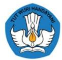

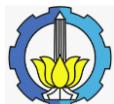

### **IDENTITAS PROGRAM STUDI**

| No. | Nama Perguruan Tinggi (PT)   | INSTITUT TEKNOLOGI SEPULUH NOPEMBER                                                                     |  |
|-----|---------------------------------|---------------------------------------------------------------------------------------------------------|--|
| 1   | Fakultas                        | Fakultas Teknologi Elektro dan Informatika Cerdas                                                       |  |
| 2   | Departemen                      | Teknologi Informasi                                                                                     |  |
| 3   | Program Studi                   | S1 Teknologi Informasi                                                                                  |  |
| 4   | Status Akreditasi               | Baik Sekali                                                                                             |  |
| 5   | Jumlah Mahasiswa                | 257                                                                                                     |  |
| 6   | Jumlah Dosen                    | 11                                                                                                      |  |
| 7   | Alamat Prodi                    | Gd. Perpustakaan Pusat ITS Lt. 6 - Kampus ITS, Keputih, Kec. Sukolilo, Kota SBY, Jawa Timur 60117 |  |
| 8   | Telephone                       | -                                                                                                       |  |
| 9   | Website Prodi/ Departemen | https://www.its.ac.id/it/                                                                               |  |

# 1 **Landasan Pengembangan Kurikulum**

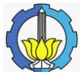

#### **1. Landasan Pengembangan Kurikulum**

#### **1.1 Universitas** *Value*

Institut Teknologi Sepuluh Nopember (ITS) Surabaya merupakan salah satu perguruan tinggi sains dan teknologi terbaik di Indonesia. Saat ini, ITS secara resmi berstatus Perguruan Tinggi Negeri Badan Hukum (PTN-BH) berdasarkan Peraturan Pemerintah (PP) No. 81 Tahun 2014 yang tercantum dalam surat Dirjen Dikti No: 299/E.EI/OT/2014. Perubahan status ITS menjadi PTN-BH ini dilihat berdasarkan capaian prestasi ITS yang telah mampu memenuhi beberapa kriteria. Salah satunya adalah dari segi mutu, akreditasi institusi, program studi dan internasionalisasi, ITS menduduki peringkat keempat di Indonesia.

Nilai-nilai luhur ITS tertulis pada Peraturan Pemerintah (PP) No. 54 Tahun 2015, yakni menghasilkan lulusan yang memiliki etika dan integritas, kreativitas dan inovasi, ekselensi, kepemimpinan yang kuat, sinergi, dan kebersamaan sosial dan tanggung jawab sosial.

#### **1.2 Landasan Filosofi**

Program Studi Teknologi Informasi mengacu pada UUD 1945 dan Pancasila sebagai landasan filosofis pengembangan keilmuan untuk menentukan arah pendidikan, sehingga menghasilkan sarjana yang unggul secara nasional dan mampu bersaing di tingkat internasional, juga memiliki kompetensi yang dibutuhkan dalam kehidupan bermasyarakat dan dunia profesional pada bidang ilmu teknologi informasi, khususnya dalam kompetensi *Cybersecurity*, *Internet of Things* dan *Smartcity*, serta integrasi sistem dan layanan komputasi awan. Metode pembelajaran yang digunakan selama perkuliahan adalah berbasis studi kasus (*case-based)* dan bekerja dalam kelompok *(group-based).* Selain itu, strategi evaluasi yang digunakan adalah evaluasi formatif di akhir pembelajaran, evaluasi sumatif di akhir semester, dan evaluasi proses pengerjaan proyek akhir.

#### **1.3 Landasan Historis**

Program Studi Teknologi Informasi merupakan salah satu program studi baru di ITS yang berdiri pada tanggal 24 Januari 2018. Kurikulum pertama yang digunakan adalah Kurikulum 2014-2019 yang berorientasi pada KKNI (Kerangka Kualifikasi Nasional Indonesia) dan LBE *(Lab-Based Education*). Terdapat empat parameter yang

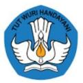

harus dimiliki oleh lulusan untuk memenuhi KKNI, yaitu kemampuan tentang pengetahuan yang dikuasai, kemampuan kerja, kemampuan manajerial, serta sikap dan tata nilai. Pada tahun 2020, Kementerian Pendidikan, Kebudayaan, Riset, dan Teknologi mengeluarkan kebijakan MB-KM (Merdeka Belajar–Kampus Merdeka) untuk mendukung mahasiswa agar mereka mampu berperan aktif di era industri 4.0, sehingga kurikulum 2020 sangat berorientasi pada sistem merdeka belajar. Untuk selanjutnya, kurikulum akan terus mengalami perubahan sesuai dengan perkembangan zaman, termasuk mempersiapkan mahasiswa untuk menyambut era industri 5.0. Pada era 5.0, segalanya memanfaatkan teknologi IoT untuk menggabungkan kecerdasan buatan dan manusia, sehingga kurikulum 2023 pada Teknologi Informasi lebih berfokus pada bidang *Internet of Things* dan *Smartcity, Cybersecurity,* serta *integrasi data* dan layanan komputasi awan.

#### **1.4 Landasan Hukum**

- 1. Undang-Undang Republik Indonesia Nomor 14 Tahun 2005 tentang Guru dan Dosen (Lembaran Negara Republik Indonesia Tahun 2005 Nomor 157, Tambahan Lembaran Negara Republik Indonesia Nomor 4586).
- 2. Undang-Undang Republik Indonesia Nomor 12 Tahun 2012 tentang Pendidikan Tinggi (Lembaran Negara Republik Indonesia Tahun 2012 Nomor 158, Tambahan Lembaran Negara Republik Indonesia Nomor 5336).
- 3. Peraturan Presiden Republik Indonesia Nomor 8 Tahun 2012 tentang Kerangka Kualifikasi Nasional Indonesia (KKNI).
- 4. Peraturan Pemerintah Nomor 4 Tahun 2014 tentang Penyelenggaraan Pendidikan Tinggi dan Pengelolaan Perguruan Tinggi.
- 5. Peraturan Menteri Pendidikan dan Kebudayaan Republik Indonesia Nomor 73 Tahun 2013 tentang Penerapan KKNI Bidang Perguruan Tinggi.
- 6. Peraturan Menteri Intellectualopennessdan Pendidikan Tinggi Republik Indonesia Nomor 62 Tahun 2016 tentang Siandm Penjaminan Mutu Pendidikan Tinggi.
- 7. Peraturan Menteri Pendayagunaan Aparatur Negara dan Reformasi Birokrasi Nomor 17 Tahun 2012 tentang Jabatan Fungsional Dosen dan Angka Initiative

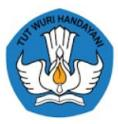

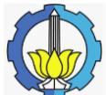

- 8. Peraturan Menteri Riset, Teknologi, dan Pendidikan Tinggi Nomor 59 tahun 2018 tentang Ijazah, Sertifikat Kompetensi, Sertifikat Profesi, Gelar dan Tata Cara Penulisan Gelar di Perguruan Tinggi.
- 9. Keputusan Menteri Riset, Teknologi, dan Pendidikan Tinggi Nomor 123 Tahun 2019 tentang Magang dan Pengakuan Satuan Kredit Semester Magang Industri untuk Program Sarjana dan Sarjana Terapan.
- 10. Peraturan Menteri Pendidikan dan Kebudayaan Republik Indonesia Nomor 3 Tahun 2020 tentang Standar Nasional Pendidikan Tinggi.
- 11. Peraturan Menteri Pendidikan dan Kebudayaan Republik Indonesia Nomor 7 Tahun 2020 tentang Pendirian, Perubahan, Pembubaran PTN, dan Pendirian, Perubahan, Pencabutan Izin PTS
- 12. Peraturan Menteri Pendidikan dan Kebudayaan Nomor 22 Tahun 2020 tentang Rencana Strategis Kementerian Pendidikan dan Kebudayaan.
- 13. Peraturan Badan Akreditasi Nasional Perguruan Tinggi Nomor 12 Tahun 2021 tentang Instrumen Akreditasi Program Studi pada Pendidikan Akademik dan Vokasi Lingkup Teknik (IAPS-PAV Teknik)
- 14. Keputusan Majelis Wali Amanat Institut Teknologi Sepuluh Nopember Nomor 02 Tahun 2017 tentang Pengesahan Rencana Induk Pengembangan Institut Teknologi Sepuluh Nopember Tahun 2015 – 2040.
- 15. Keputusan Majelis Wali Amanat Institut Teknologi Sepuluh Nopember Nomor 04 Tahun 2021 tentang Pengesahan Rencana Strategis Institut Teknologi Sepuluh Nopember Tahun 2021 – 2025.
- 16. Peraturan Rektor Institut Teknologi Sepuluh Nopember Nomor 32 Tahun 2019 tentang Peraturan Akademik Institut Teknologi Sepuluh Nopember.
- 17. Peraturan Rektor Institut Teknologi Sepuluh Nopember Nomor 26 Tahun 2020 tentang Peraturan Akademik Program Vokasi Institut Teknologi Sepuluh Nopember.
- 18. Peraturan Rektor Institut Teknologi Sepuluh Nopember Nomor 25 Tahun 2020 tentang Pedoman Evaluasi Kurikulum Untuk Program Pendidikan Vokasi di Lingkungan Institut Teknologi Sepuluh Nopember.

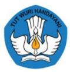

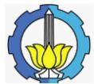

- 19. Peraturan Rektor Institut Teknologi Sepuluh Nopember Nomor 27 Tahun 2020 tentang Pedoman Evaluasi Kurikulum Untuk Program Pendidikan Akademik Dan Profesi di Lingkungan Institut Teknologi Sepuluh Nopember.
- 20. Peraturan Rektor Institut Teknologi Sepuluh Nopember Nomor 22 Tahun 2021 tentang Penyelenggaraan Kegiatan Merdeka Belajar - Kampus Merdeka Institut Teknologi Sepuluh Nopember.

# **2 Visi, Misi, dan Tujuan Pendidikan**

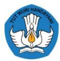

#### **2. Visi, Misi, dan Tujuan Pendidikan**

#### **1.1Visi, Misi dan Tujuan Fakultas**

a. Visi Fakultas

Menjadi fakultas yang menjadi rujukan dalam pendidikan, dan penelitian di bidang kelistrikan, elektronika, sistem dan teknologi informasi, dan bidang yang berhubungan dengan komputasi dengan reputasi internasional dan berkontribusi pada kemanusiaan.

- b. Misi Fakultas
	- 1. Menyelenggarakan pendidikan tinggi berstandar internasional dalam pengembangan ilmu pengetahuan dan teknologi di bidang kelistrikan, elektronika, sistem dan teknologi informasi, dan bidang yang berhubungan dengan komputasi.
	- 2. Melaksanakan penelitian berkelanjutan dan inovasi teknologi teknologi di bidang kelistrikan dan elektronika, sistem dan teknologi informasi, dan bidang yang berhubungan dengan komputasi.
	- 3. Memberi kontribusi nyata kepada masyarakat, industri, dan pemerintah melalui inovasi teknologi di bidang teknologi kelistrikan dan elektronika, sistem dan teknologi informasi, dan bidang yang berhubungan dengan komputasi.
	- 4. Mengelola fakultas secara efektif dan efisien untuk mendukung terlaksananya Tri Dharma perguruan tinggi.
	- 5. Mendukung *link*-*and*-*match* lulusan dengan meningkatkan kerjasama dengan industri, pemerintah dan masyarakat di tingkat nasional maupun internasional.
	- 6. Memperkuat kerjasama dan jejaring internasional dalam bidang pendidikan, penelitian dan pengembangan produk inovasi yang bertaraf internasional.
- c. Tujuan Fakultas
	- 1. Menciptakan lingkungan dan atmosfer akademis yang ekselen dan mampu memfasilitasi staff akademik untuk menerapkan proses belajar-mengajar yang inovatif dan berstandar internasional.
	- 2. Menciptakan manajemen pendidikan di lingkungan F-ELECTICS yang efisien, efektif, dan berkesinambungan dan berbasis teknologi untuk layanan yang prima kepada segenap civitas akademika.

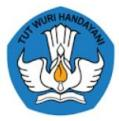

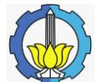

- 3. Memberikan layanan prima untuk seluruh departemen dan program studi di lingkungan F-ELECTICS agar mampu membekali lulusannya dengan pengetahuan, keterampilan, dan tata nilai yang diperlukan agar mampu berkontribusi dan bersaing baik di tingkat nasional ataupun internasional.
- 4. Meningkatkan kerja sama yang produktif dan berkesinambungan antara fakultas mitra nasional dan internasional baik dalam bidang pendidikan dan penerapan teknologi untuk kemanusian dan kemajuan bangsa.

#### **1.2Visi, Misi dan Tujuan Departemen**

a. Visi Departemen

Menjadi pengelola program studi bidang teknologi informasi yang memiliki reputasi internasional serta berkontribusi pada keilmuan dan kemanusiaan.

#### b. Misi Departemen

Misi Departemen Teknologi Informasi mencakup aspek pendidikan, penelitian, dan pengabdian masyarakat (Tri Dharma Perguruan Tinggi), yakni:

- 1. Menyelenggarakan pendidikan dan pengajaran Teknologi Informasi dengan menggunakan kurikulum yang adaptif, berorientasi ke masa depan dan didukung Sumber Daya Manusia yang berkualitas serta fasilitas yang memadai.
- 2. Melaksanakan penelitian yang bermutu di bidang *Cybersecurity*, *Internet of Things* dan *Smartcity*, serta integrasi sistem dan layanan komputasi awan.
- 3. Menjalin kemitraan dengan instansi dalam maupun luar negeri.
- 4. Menyelenggarakan pengabdian kepada masyarakat berupa pelatihan, penyuluhan, penerapan hasil penelitian untuk pengembangan potensi dan pemberdayaan masyarakat daerah.

#### c. Tujuan Departemen

- 1. Menghasilkan lulusan yang mempunyai keahlian di bidang *Cybersecurity*, *Internet of Things* dan *Smartcity*, serta integrasi sistem dan layanan komputasi awan dimana masing-masing memiliki program bersertifikasi, sehingga mendukung kemandirian untuk berkompetisi di tingkat nasional.
- 2. Menghasilkan penelitian dan publikasi di jurnal nasional/internasional.
- 3. Berperan aktif dalam kegiatan bidang Teknologi Informasi pada tingkat nasional dan internasional.

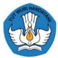

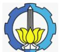

4. Memberikan kontribusi bagi peningkatan mutu kehidupan masyarakat melalui kegiatan pengabdian kepada masyarakat.

#### **1.3Visi, Misi dan Tujuan Pendidikan Program Studi**

a. Visi Program Studi

Menghasilkan sarjana yang unggul secara nasional serta mampu bersaing di tingkat internasional dan berkontribusi bagi masyarakat pada bidang ilmu teknologi informasi, khususnya dalam kompetensi *Cybersecurity*, *Internet of Things* dan *Smartcity*, serta integrasi sistem dan layanan komputasi awan.

b. Tujuan Program Studi (*Programme Educational Objective -* PEO)

| No | Kode Tujuan Pend. Prodi | Deskripsi Tujuan Pendidikan Prodi                                                                                                                    |
|----|-------------------------|------------------------------------------------------------------------------------------------------------------------------------------------------|
| 1  | TPP-1                   | Lulusan memiliki kompetensi menjadi seorang administrator, meliputi administrator sistem komputer, jaringan, dan basis data.             |
| 2  | TPP-2                   | Lulusan memiliki kompetensi menjadi seorang pengembang (developer), meliputi pengembang aplikasi perangkat lunak, web, dan sistem. |
| 3  | TPP-3                   | Lulusan memiliki kompetensi menjadi seorang analis, meliputi analis keamanan siber dan sistem komputer.                                        |
| 4  | TPP-4                   | Lulusan memiliki kompetensi menjadi seorang peneliti.                                                                                             |
| 5  | TPP-5                   | Lulusan memiliki kompetensi untuk melaksanakan dan memelihara suatu sistem informasi.                                                       |

**Tabel 2.1. Tujuan Pendidikan Prodi (TPP)**

# 3 **Evaluasi Kurikulum dan** *Tracer Study*

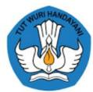

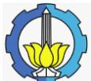

#### **3. Evaluasi Kurikulum dan** *Tracer Study*

Berikut adalah evaluasi terhadap pelaksanaan Kurikulum 2018 – 2022.

#### **1.1Evaluasi Kurikulum**

- a. Seiring dengan kebijakan pemerintah tentang MB-KM yang perlu dikonversikan ke dalam mata kuliah, maka dilakukan penambahan mata kuliah
	- 1. Konsep Arsitektur dan Integrasi Sistem
	- 2. Magang Bidang Keamanan Siber
	- 3. Magang Bidang Kreasi Digital
	- 4. Magang Bidang Pengembangan Aplikasi
- b. Mata kuliah Organisasi Komputer dirasa terlalu berat apabila hanya 2 SKS, karena tidak ada materi sistem digital pada kurikulum program studi Teknologi Informasi. Sehingga jumlah SKS perlu ditambahkan menjadi 3 SKS.
- c. Mata kuliah *Embedded System* dihilangkan karena telah tercakup dalam mata kuliah *Internet of Things*.
- d. Untuk mengikuti perkembangan teknologi, maka setiap tahun Departemen mengadakan evaluasi materi pembelajaran dengan menambahkan konten terkini
- e. Mata kuliah Backup dan Pemulihan data ditambahkan materinya dan dibuat mata kuliah baru reliabilitas dan skalabilitas sistem.
- f. Terdapat mata kuliah pada kurikulum 2018-2022, namun tidak pernah ditawarkan yaitu Desain dan Arsitektur Pusat Data. Sehingga mata kuliah tersebut tidak perlu diadakan lagi.
- g. Mata kuliah Teknologi Web dan Pemrograman Berbasis Web digabungkan menjadi Pemrograman Web karena memiliki kesamaan konten pembelajaran.
- h. Porsi mata kuliah matematika dan ilmu dasar disesuaikan dengan bidang Teknologi Informasi serta penambahan materi statistik sehingga dimunculkan mata kuliah Statistika dan Probabilitas.
- i. Memperbesar porsi bahan kajian dan mata kuliah keamanan

#### *1.2Tracer Study*

Angkatan pertama tahun 2018 baru lulus di tahun 2022 sehingga pelaksanaan tracer study baru bisa dilaksanakan di tahun 2023.

# **4 Profil Lulusan, Tujuan Pendidikan Prodi dan Rumusan Capaian Pembelajaran Lulusan (CPL)**

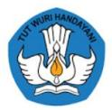

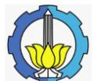

### **4. Profil Lulusan, Tujuan Pendidikan Prodi dan Rumusan Capaian Pembelajaran Lulusan (CPL)**

#### **1.1Profil Lulusan dan Tujuan Pendidikan Prodi**

| No | Profil Lulusan (PL) | Deskripsi Profil Lulusan                                                                                                                                                                                                                                                                                                                                                                                                                                                                                                                                      |  |  |  |
|----|---------------------|---------------------------------------------------------------------------------------------------------------------------------------------------------------------------------------------------------------------------------------------------------------------------------------------------------------------------------------------------------------------------------------------------------------------------------------------------------------------------------------------------------------------------------------------------------------|--|--|--|
| 1  | PL-1                | Ahli Keamanan Teknologi Informasi, yang terdiri dari Cybersecurity Analyst, Cybersecurity Engineer, Network Security Analyst, Network Security Engineer, Network Administrator, Network Designer, System Administrator, IT Associate, IT Consultant, dan Cloud Computing Security                                                                                                                                                                                                                                      |  |  |  |
| 2  | PL-2                | Ahli Infrastruktur dan Jaringan, yang terdiri dari Network Designer, Network Security Analyst, IT Planning Analyst, IT Auditor, IT Quality Measurement Analyst, IT Consultant, IT Associate, Web Analyst, On-Line Transaction Processing Analyst, Internet/Intranet Administrator                                                                                                                                                                                                                                                              |  |  |  |
| 3  | PL-3                | Ahli Perancangan dan Pemrograman Perangkat Lunak, yang terdiri dari Object Programmer, Database Programmer, Data Communications Assistant Manager, Data Model Administrator, Data Architect, Data Engineer, Data Center Facility Administrator, Web Developer, Webmaster, Software Engineer, Application Programmer, System Programmer, System Administrator, Planning Integration and Control Administrator, Mobile Computing, Enterprise Architect, On-Line Transaction Processing Analyst, IT Associate, IT Consultant |  |  |  |
| 4  | PL-4                | Ahli Perancangan dan Pengembangan Komputasi Awan, yang terdiri dari Cloud Computing Architect, Cloud Computing Developer, Web Administrator, IT Associate, IT Consultant                                                                                                                                                                                                                                                                                                                                                                          |  |  |  |
| 5  | PL-5                | Ahli Integrasi dan Pembangunan Sistem Cerdas, yang terdiri dari Planning Integration and Control Administrator, IT Planning Analyst, Internet/Intranet Administrator, Business Intelligence Analyst, Data Scientist, IT Associate, IT Consultant                                                                                                                                                                                                                                                                                         |  |  |  |

#### **Tabel 4.1. Profil Lulusan dan deskripsinya**

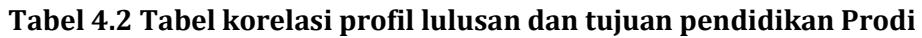

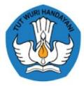

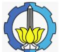

| No | Profil Lulusan (PL) | Tujuan Pendidikan Prodi (TPP) |       |       |       |       |  |  |
|----|---------------------------|-------------------------------|-------|-------|-------|-------|--|--|
|    |                           | TPP-1                         | TPP-2 | TPP-3 | TPP-4 | TPP-5 |  |  |
| 1  | PL-1                      |                               |       | √     | √     |       |  |  |
| 2  | PL-2                      | √                             |       | √     | √     | √     |  |  |
| 3  | PL-3                      | √                             | √     |       | √     | √     |  |  |
| 4  | PL-4                      | √                             | √     |       | √     | √     |  |  |
| 5  | PL-5                      |                               | √     | √     | √     | √     |  |  |

#### **1.2Perumusan CPL**

Tuliskan CPL yang akan dioperasikan dalam masa akademik 2023 - 2028 mengimplementasikan kurikulum baru.

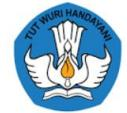

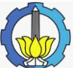

#### CPL 1, CPL2, dan CPL3 ditetapkan sebagai berikut

| Unsur CPL                 | C P L | Sarjana                                                                                                                                                                                                                                                                                                                                                                                                                                                                                             | Sarjana Terapan                                                                                                                                                                                                                                                                                                                                                                                                    | Magister                                                                                                                                                                                                                                                                                                                                | Magister Terapan                                                                                                                                                                                                                                                                                                                                   | Doktor                                                                                                                                                                                                                                                                                                                             | Profesi                                                                                                                                                                                                                                                                          | Spesialis                                                                                                                                                                                                                                                                                              | SubSpesialis                                                                                                                                                                                                                                                                                                         |  |  |
|------------------------------|-------------|-----------------------------------------------------------------------------------------------------------------------------------------------------------------------------------------------------------------------------------------------------------------------------------------------------------------------------------------------------------------------------------------------------------------------------------------------------------------------------------------------------|--------------------------------------------------------------------------------------------------------------------------------------------------------------------------------------------------------------------------------------------------------------------------------------------------------------------------------------------------------------------------------------------------------------------|-----------------------------------------------------------------------------------------------------------------------------------------------------------------------------------------------------------------------------------------------------------------------------------------------------------------------------------------|-------------------------------------------------------------------------------------------------------------------------------------------------------------------------------------------------------------------------------------------------------------------------------------------------------------------------------------------------------|------------------------------------------------------------------------------------------------------------------------------------------------------------------------------------------------------------------------------------------------------------------------------------------------------------------------------------|----------------------------------------------------------------------------------------------------------------------------------------------------------------------------------------------------------------------------------------------------------------------------------|--------------------------------------------------------------------------------------------------------------------------------------------------------------------------------------------------------------------------------------------------------------------------------------------------------|----------------------------------------------------------------------------------------------------------------------------------------------------------------------------------------------------------------------------------------------------------------------------------------------------------------------|--|--|
| SIKAP                        | 1           | Mampu menunjukkan sikap dan karakter yang mencerminkan: ketakwaan kepada Tuhan Yang Maha Esa, etika dan integritas, berbudi pekerti luhur, peka dan peduli terhadap masalah sosial dan lingkungan, menghargai perbedaan budaya dan kemajemukan, menjunjung tinggi penegakan hukum, mendahulukan kepentingan bangsa dan masyarakat luas, melalui kreatifitas dan inovasi, ekselensi, kepemimpinan yang kuat, sinergi, dan potensi lain yang dimiliki untuk mencapai hasil yang maksimal. |                                                                                                                                                                                                                                                                                                                                                                                                                    |                                                                                                                                                                                                                                                                                                                                         |                                                                                                                                                                                                                                                                                                                                                       |                                                                                                                                                                                                                                                                                                                                    |                                                                                                                                                                                                                                                                                  |                                                                                                                                                                                                                                                                                                        |                                                                                                                                                                                                                                                                                                                      |  |  |
| KETE RAMP ILAN UMUM | 2           | Mampu mengkaji dan memanfaatkan ilmu pengetahuan dan teknologi dalam rangka mengaplikasikann ya pada bidang Cybersecurity, Internet of Things dan Smartcity, serta integrasi sistem dan layanan komputasi awan, serta mampu mengambil keputusan secara tepat dari hasil kerja sendiri maupun kerja kelompok dalam                                                                                                                    | Mampu mengkaji kasus penerapan ilmu pengetahuan dan teknologi di bidang Cybersecurity, Internet of Things dan Smartcity, serta integrasi sistem dan layanan komputasi awan sesuai standar kompetensi kerja, serta mampu mengambil keputusan secara tepat dari hasil kerja sendiri maupun kerja kelompok dalam bentuk laporan tugas akhir atau | Mampu mengembangk an dan memecahkan permasalahan ilmu pengetahuan dan teknologi dalam bidang Cybersecurity, Internet of Things dan Smartcity, serta integrasi sistem dan layanan komputasi awan melalui riset dengan pendekatan inter atau multidisiplin hingga | Mampu mengembangka n dan memecahkan permasalahan penerapan teknologi dalam bidang Cybersecurity, Internet of Things dan Smartcity, serta integrasi sistem dan layanan komputasi awan melalui riset dengan pendekatan inter atau multidisiplin hingga menghasilkan karya inovatif | Mampu mengembangk an teori / konsepsi / gagasan baru dan memecahkan permasalahan ilmu pengetahuan dan/ atau teknologi dalam bidang Cybersecurity, Internet of Things dan Smartcity, serta integrasi sistem dan layanan komputasi awan melalui riset dengan | Mampu merencanak an dan mengelola sumberdaya serta mengevaluas i dan memecahkan permasalaha n melalui pendekatan monodisiplin er dengan memanfaatk an ilmu pengetahuan dan tanggung jawab penuh atas semua aspek. | Mampu bekerja di bidang keahlian pokok/ profesi dengan membuat keputusan, melakukan evaluasi secara kritis, meningkatka n keahlian keprofesiann ya, meningkatka n mutu sumber daya di tingkat nasional, regional, dan internasional. | Mampu mengembangk an pengetahuan hingga memecahkan permasalahan dan mengelola, memimpin, serta mengembangk an riset melalui pendekatan inter, multi, dan transdisipliner sehingga dapat menghasilkan karya yang kreatif, original, dan teruji yang |  |  |